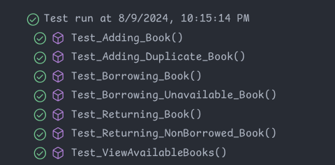

# Library Management System

This project allows users to perform basic operations such as adding books, borrowing books, returning books, and viewing available books.

## Prerequisites

- **Java 17**: Ensure that Java 17 or later installed on your machine.
- **Gradle 7.2**: If you don't have gradle installed still it will work as we are using Gradle Wrapper.

## Setup

1. **Clone the Repository:**

   ```bash
   git clone https://github.com/Ashish-CodeJourney/LibraryManagement.git
   ```
   ```
   cd LibraryManagement
   ```

2. **Build the Project:**

   Use Gradle to build the project. This will also download any necessary dependencies.

   ```bash
   ./gradlew build
   ```

## Running Tests

The project uses JUnit 5 for unit testing. To run the tests, use the following command:

```bash
./gradlew test
```

## Test Cases

Here are the test cases covered in this KATA:

### **Book Class Tests**

1. **Test_BookCreation**:

2. **Test_SetAvailable**:


### **LibraryManagement Class Tests**

1. **Test_Adding_Book**:

2. **Test_Adding_Duplicate_Book**:

3. **Test_Borrowing_Book**:

4. **Test_Borrowing_Unavailable_Book**:

5. **Test_Returning_Book**:

6. **Test_Returning_NonBorrowed_Book**:

7. **Test_ViewAvailableBooks**:




